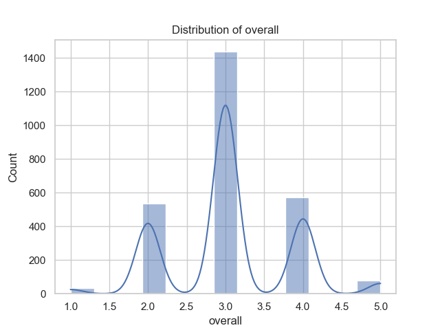

The provided data summary offers a comprehensive overview of a collection of media items recorded in a dataset. Here’s a detailed analysis of its various components:

### Summary Analysis

#### 1. **Date Information**
- **Total Entries**: 2553 with 2055 unique dates suggests that the dataset has multiple entries for some days.
- **Most Frequent Date**: The date '21-May-06' appears 8 times, indicating that certain days may have had more media releases or activities than others.
- **Missing Values**: A total of 99 missing values in the date field indicates potential gaps in recorded data, which could impact time-series analysis if applicable.

#### 2. **Language Data**
- **Total Entries**: 2652 with 11 unique languages highlights a diverse range of media content.
- **Dominant Language**: English is the top language, appearing in 1306 entries, accounting for approximately 49% of the dataset.
- **No Missing Values**: The absence of missing data in this category suggests reliable language attribution for all entries.

#### 3. **Media Type**
- **Total Count**: 2652 with 8 unique types primarily focusing on 'movie' (2211 entries), has a clear predominance of this category. This implies a robust collection of movie-related content, potentially skewing overall analysis toward this type of media.
- **No Missing Values**: Similar to language, all entries have an assigned type.

#### 4. **Title Data**
- **Count and Uniqueness**: There are 2652 records with 2312 unique titles. The highest frequency title is 'Kanda Naal Mudhal' which appears 9 times.
- **Missing Values**: No titles are missing, highlighting complete data capture in this domain.

#### 5. **Created By (Authoring/Production Credits)**
- **Total Count**: 2390 entries with 1528 unique contributors; 'Kiefer Sutherland' is the most frequent contributor, credited 48 times. The diversity in contributors might indicate a rich fabric of collaboration or many collaborations led by established names.
- **Significant Missing Values**: There are 262 missing entries, which could mean a loss of critical attribution data.

#### 6. **Overall Scores**
- **Overall Rating**: The mean overall score is approximately 3.05, with a standard deviation of 0.76, suggesting that ratings are fairly consistent, skewing slightly toward the mid-range.
- **Quality Ratings**: A mean quality score of about 3.21 indicates a perception of the media's quality, with a standard deviation of 0.80 reflecting varied perceptions. Ratings range from 1 to 5, with 3 being the median score.
- **Repeatability Ratings**: The mean repeatability score of about 1.49 indicates that most entries are not frequently revisited or watched, aligning with typical media consumption patterns where a single viewing is common.

#### 7. **Correlation Analysis**
- **Overall Correlation**: The strongest correlation (0.83) is between overall ratings and quality, implying that higher perceived quality consistently translates to better overall scores.
- **Moderate Correlation**: There’s a moderate correlation (0.51) between overall ratings and repeatability, indicating that while some viewers may enjoy repeating certain media, it is not the predominant experience.
- **Weak Correlation**: The weak correlation (0.31) between quality and repeatability indicates less consistent viewer behavior regarding revisiting media they judge to be of high quality.

#### 8. **Clustering of Data**
- **Clusters**: The data is categorized into three prominent clusters. The largest cluster (2) indicates that a majority of the media fall into one significant category, with cluster distributions potentially indicating different genres, ratings, or thematic elements.
  - **Cluster Sizes**: Cluster (2) has 1369 entries, which is substantially larger than clusters (0) with 673 and (1) with 610, suggesting a dominant theme or feature that appeals to audiences.

### Conclusion
The dataset reflects a strong predominance of English-language movies, with a solid blend of other languages. The quality ratings and overall satisfaction appear moderately aligned, while repeatability shows less correlation with quality perceptions, indicating viewing habits typical for casual media consumption. Inefficiencies are evident in missing values particularly in the 'by' field, indicating potential areas for data improvement. The clustering suggests avenues for targeted campaigns or analysis based on audience engagement trends.

## Visualizations

